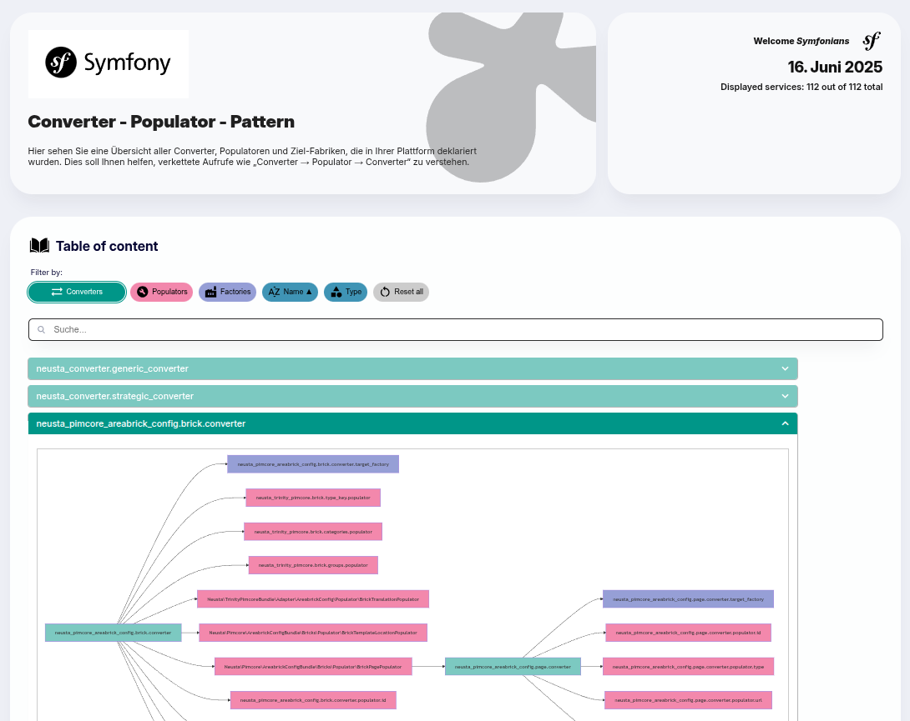

# Command 

## neusta:converter:debug
Displays debug information about all registered converters, populators, and factories in the application. Optionally generates a static HTML overview for documentation purposes.

## Usage
```shell
bin/console neusta:converter:debug
```

## Description
This command inspects services tagged as:

* converter
* populator
* factory

For each, it outputs:

* The service ID
* The fully qualified class name
* Constructor arguments (including nested structures)

It supports two modes:

* CLI output: Displayed directly in the terminal.
* HTML output: Exported to a file for documentation.

## Options

|Option    |Description                                                                |
|--out=PATH|	Optional. If set, generates a static HTML file with all converter data.|

### Example HTML output

