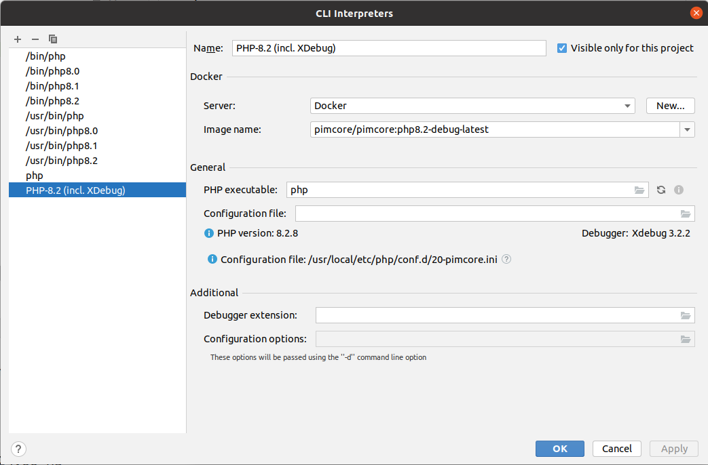
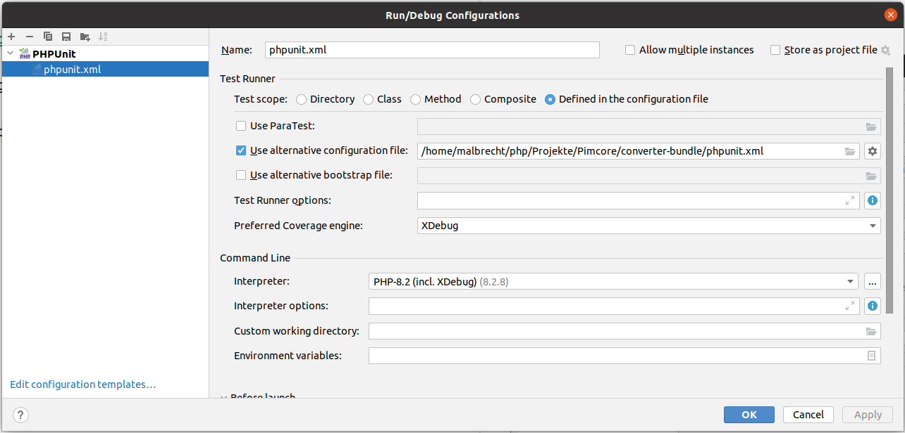

## Development

### Running tests (incl. code coverage)

If you want to run the tests (incl. code coverage) you can do so by configuring Phpstorm in the following way:

You can see that we are using the image `pimcore/pimcore:php8.2-debug-latest` here. Of course this could be updated
after a while.
But with this image we can do code coverage by running all tests via phpunit.xml:

